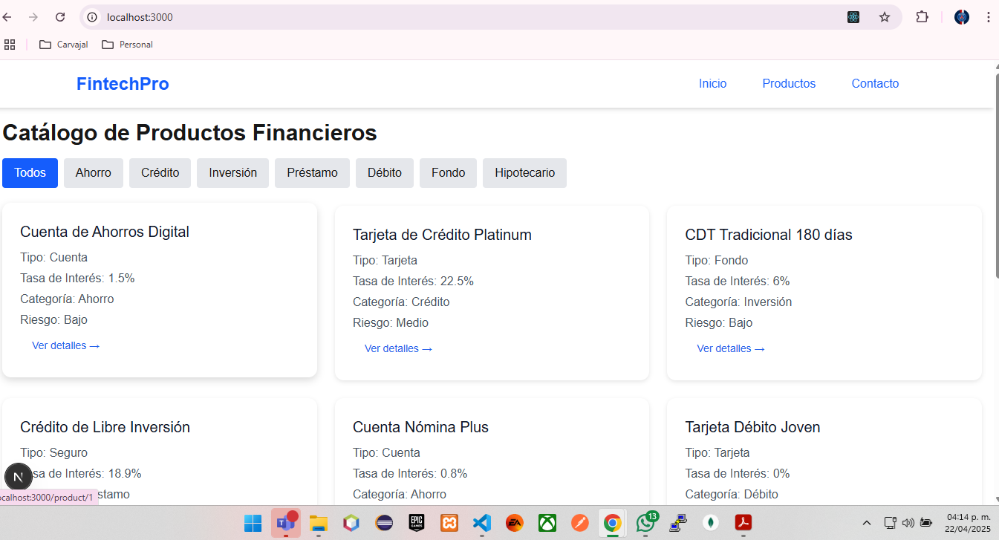
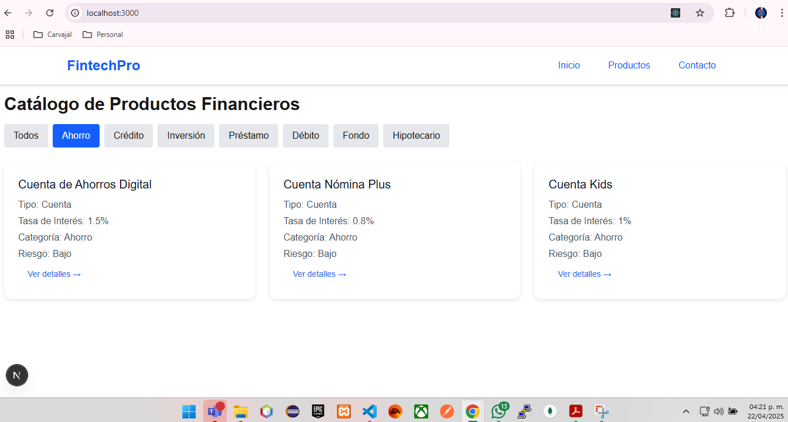
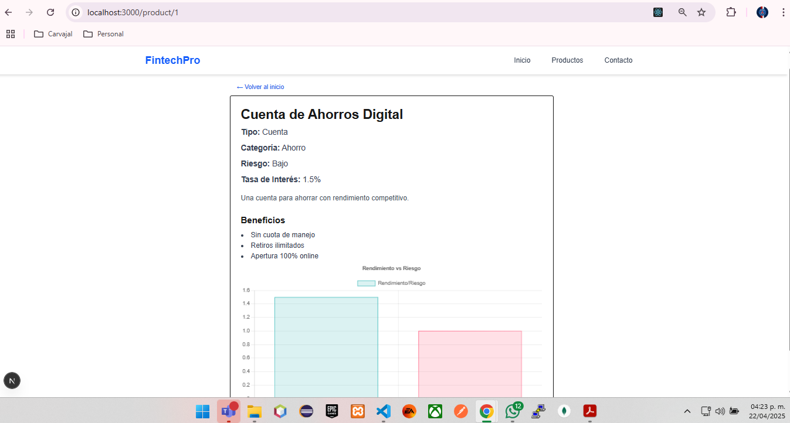
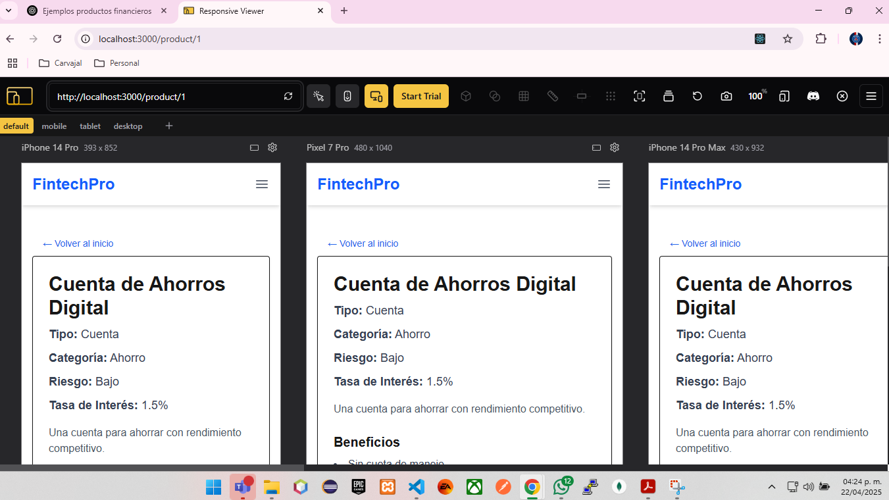

# FintechPro - Aplicación de Productos Financieros

Esta es una aplicación que muestra productos financieros con un diseño minimalista y accesible, utilizando React, Tailwind CSS y Styled Components. La plataforma está diseñada para que sea fácil de usar, profesional y completamente responsiva.

## Instrucciones de Instalación y Ejecución

### Requisitos previos

Asegúrate de tener instalados los siguientes programas en tu máquina:

- **Node.js** (versión 16 o superior)
- **npm** (se instala junto con Node.js)

Puedes verificar si tienes **Node.js** y **npm** instalados ejecutando los siguientes comandos:

node -v
npm -v

# ------------------------------------------------------------------------------------------------------
###  Inicializar proyecto Next.js con App Router:

- **npx create-next-app@latest fintech-landing --typescript --app --tailwind** 

# Instalar dependencias adicionales:
- **npm install styled-components @types/styled-components** 
- **npm install --save-dev babel-plugin-styled-components** 
- **npm install clsx** 
- **npm install @heroicons/react** 
- **npm install lucide-react** 
- **npm install chart.js react-chartjs-2**
# ------------------------------------------------------------------------------------------------------
### Pasos rápidos para revisar la vista actual:

# Pasos rápidos para revisar la vista actual:

- **Ejecuta tu servidor de desarrollo en la terminal, utiliza el siguiente comando: npm run dev**
- **Abre tu navegador y ve a http://localhost:3000**

### Imagen Home de plataforma

### Imagen Funcionabilidad de filtro producto ahorro

### Imagen Detalle del producto seleccionado

### Imagen de plataforma responsive con funcionabilidad de menu hamburguesa

# ------------------------------------------------------------------------------------------------------
### Preguntas Complementarias

## 1. ¿Qué criterios seguiste para diseñar la UI de productos financieros?
Cuando estaba diseñando la interfaz, mi enfoque principal fue asegurarme de que fuera clara, fácil de usar y que generara confianza en los usuarios. Aquí algunos de los criterios que seguí:

- **Accesibilidad visual**: Utilicé un contraste adecuado, tipografías legibles y una estructura de información bien organizada para facilitar la lectura y navegación.
- **Diseño sobrio y profesional**: El diseño es minimalista y usa colores neutros, ya que quiero que los usuarios sientan confianza y seriedad al interactuar con la plataforma.
- **Enfoque en el usuario**: Las tarjetas de productos están pensadas para resaltar solo la información más relevante, como el nombre del producto, la tasa de interés, los riesgos y los beneficios.
- **Consistencia visual**: Todos los componentes del diseño siguen un patrón consistente, lo que ayuda a que la experiencia de usuario sea fluida y coherente en todo momento.

## 2. ¿Cómo decidiste cuándo usar Tailwind y cuándo Styled Components?
Aquí lo que busqué fue lo mejor de ambos frentes:

- **Tailwind CSS**: Lo usé para aplicar estilos rápidos, crear la estructura general de la página y asegurarme de que fuera completamente responsiva. Es ideal para prototipar rápido y no tener que preocuparme por crear archivos CSS adicionales.
- **Styled Components**: Lo utilicé para componentes más específicos, como botones o elementos que necesitaban tener un estilo más personalizado o con animaciones especiales. Esto me permitió tener un mayor control y encapsulamiento sobre los estilos.

Me gusta esta combinación porque me ofrece flexibilidad y agilidad para desarrollar sin sacrificar la calidad.

## 3. ¿Qué harías para escalar este proyecto en una aplicación real de banca digital?
Si tuviera que llevar este proyecto a una plataforma real de banca digital, lo enfocaría en algunos puntos clave para garantizar que sea segura, escalable y robusta:

- **Autenticación segura**: Implementaría un sistema de autenticación con OAuth2 o JWT, y me integraría con sistemas bancarios existentes para garantizar la seguridad de los usuarios.
- **Backend robusto**: Migraría la lógica de `getProducts()` a un backend con una API RESTful, y lo conectaría a una base de datos segura para manejar grandes volúmenes de datos.
- **Gestión de estado global**: Usaría herramientas como Redux Toolkit o React Query para mejorar el manejo de datos en toda la aplicación de manera eficiente.
- **Internacionalización y accesibilidad**: Aseguraría que la plataforma esté lista para ser utilizada en diferentes idiomas y que cumpla con los estándares de accesibilidad para todos los usuarios.
- **Testing profesional**: Implementaría pruebas unitarias, pruebas de integración  y revisaría las vulnerabilidades de seguridad.

## 4. ¿Qué herramientas usarías para mejorar el rendimiento y monitoreo en producción?
Para asegurarme de que la aplicación esté funcionando de manera óptima y monitorear cualquier posible problema en producción, me apoyaría en varias herramientas:

- **Vercel Analytics o Lighthouse CI**: Las usaría para medir el rendimiento en tiempo real y detectar áreas de mejora.
- **Sentry**: Esta herramienta me ayudaría a monitorear los errores en el frontend y recibir alertas de problemas críticos en producción.
- **LogRocket o FullStory**: Para entender cómo interactúan los usuarios con la plataforma y poder mejorar la experiencia en base a datos reales de comportamiento.
- **Next.js Middleware + ISR**: Esto ayudaría a mejorar los tiempos de carga y asegurarse de que los usuarios siempre tengan una experiencia rápida sin sacrificar el contenido dinámico.
- **Bundle Analyzer**: Para analizar el tamaño del build y optimizar la carga de recursos.
- **Google Tag Manager + GA4**: Usaría estas herramientas para obtener información analítica sobre cómo los usuarios navegan por la plataforma, sin comprometer el rendimiento.

Todo esto ayudaría a tener una plataforma rápida, confiable y con una gran experiencia para el usuario final.
